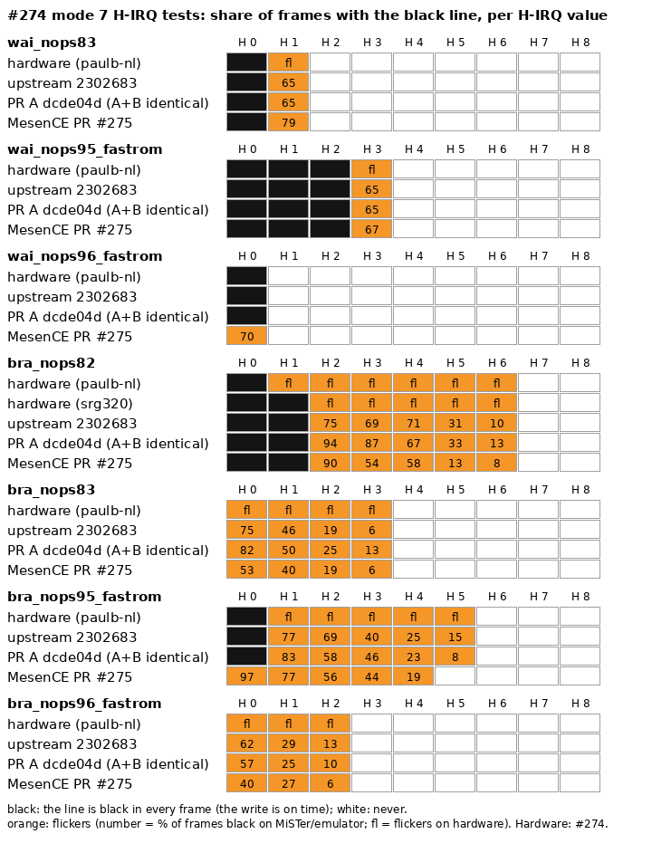

# Evidence for the SNES H/V IRQ, PPU timing and `$2137` PRs (refs #460)

**PR #513 as five commits (`ppu-timing-stack` at `ae0818c`): [`ab/E`](ab/E/README.md).** The PR was rebuilt after review
into five commits (NMI, V counter, H/V IRQ + Mode 7, BG fetch/force blank, OBJ under force blank). `ab/E` maps each commit to
the cores it was run as (each prebuilt `.rbf` is byte-identical to the tested build), and holds the IRQ test results, the
Kirby Super Star `DI_WAIT` case, HblankEmuTest, the #514 combination, seed-1 timing (no 30-seed sweep for this version)
and the hardware test kit. The sections below describe the earlier four-commit layout (labels A-D), whose recordings
`ab/E` reuses where it says so.

This branch holds evidence only: no RTL. The changes are two pull requests from `mcfbytes/SNES_MiSTer`: one stack of four
commits, and one independent commit. The labels A, B, C and D name the evidence packs (`ab/A` ...).

| label | change | branch | commit | tested as (same git tree) |
|---|---|---|---|---|
| A | H/V IRQ flag 6 master clocks later | `ppu-timing-stack` | `18ea233` | `2ff03cf` |
| A | the Mode 7 precalc moved with it | `ppu-timing-stack` | `944cdfb` | `dcde04d` |
| B | PPU BG fetch, output and force-blank timing (#460) | `ppu-timing-stack` | `b7d997f` | `3f33d28` |
| D | the sprite stage under force blank (HblankEmuTest) | `ppu-timing-stack` | `8e89569` | `0f6b5e4` |
| C | `$2137` latches only while `$4201` bit 7 is set | `slhv-wrio-gate` | `57160ab` | `57160ab` |
| E | the five-commit #513 (`1f69c08`, `e98ca40`, `5fe4edd`, `dce0098`, `ae0818c`) | `ppu-timing-stack` | `ae0818c` | `ec98508` (same `.rbf`) |

`ppu-timing-stack` sits on master `2302683`. Rows A, B and D are its earlier four-commit layout (now replaced by E); each of those commits had the same git tree as the commit it was built and
tested as (last column; only the commit messages differ), so the cores, recordings and hashes here, which carry the
tested-as hashes, apply to it unchanged. "PR A" below means the stack through `944cdfb`, "PR B (A+B)" through `b7d997f`.
C is independent of the stack.

## Cores

Every MiSTer recording here was made on one of these builds (D's only in `ab/D`). They are the assets of the pre-release
[`evidence-460-cores`](https://github.com/mcfbytes/SNES_MiSTer/releases/tag/evidence-460-cores).

| label | commit | release asset | sha256 | worst setup / hold slack |
|---|---|---|---|---|
| upstream | `2302683` | `SNES_upstream-2302683.rbf` | `77d089ae999a537818f3c8fca4176a5f8a01266ca6417cc59b14aaf3275db037` | +0.067 / +0.241 ns |
| PR A | `dcde04d` | `SNES_A-dcde04d.rbf` | `13e34017e602179e7865695aabbc3010ab2b4433ab1631a5fce58bd24765e720` | +0.010 / +0.243 ns |
| PR B (A+B) | `3f33d28` | `SNES_AB-3f33d28.rbf` | `3ddb923d88c89d2fc6d714136eddc43fba7ba27f7ebcbe288e1be2f70f8f79f5` | +0.032 / +0.194 ns |
| PR C | `57160ab` | `SNES_C-57160ab.rbf` | `3c3d6d10070ad19642620553c31bcf6e96d62e3a4a263fee92a580e001556a51` | +0.052 / +0.202 ns |
| PR D (A+B+D) | `0f6b5e4` | `SNES_D-0f6b5e4.rbf` | `05ab6399b5f086eb46322c41d48c47dbc18ac936f94307f675835121ef136bd2` | −0.212 ns setup, one path outside the PPU (`ab/D/hblankemu`) |

Quartus 17.0.2 Lite in `theypsilon/quartus-lite-c5:17.0.2` (the image MiSTer Seedy uses), `quartus_sh --flow compile SNES`
on a `git archive` of the commit, the `.qsf` seed (1), build date `261005` (`sys/build_id.tcl` writes it into `build_id.v`).
Slack is TimeQuest's worst over all clocks at the slow 1100 mV 100 °C model. The build date is part of the design, so a
rebuild on another day places differently: these slack figures belong to these files, and timing in general is
section 10's 30-seed statistics. A rebuild of the same commit in this image on the same date gives a byte-identical `.rbf`.

## Method

- **Rig:** a DE10-Nano, kernel `7.2.9` PREEMPT_RT, with `vm.compact_unevictable_allowed=0`, `vm.compaction_proactiveness=0`
  and the writeback workqueue cpumask `1`, all three set by the image at boot (read back before the runs: 0 / 0 / 1).
- **Recordings:** [tasty](https://github.com/mcfbytes/Tasty_MiSTer) (binary sha256 `b7b8892c…bf06`) replays a movie from
  power-on and records every frame the core outputs, before the scaler: an AVI plus a per-frame hash log
  (`*.frames.tsv`). A run is deterministic: the same movie on the same core gives the same hashes.
- **Quality gate**, on every recording (`ab/tools/recgate.py`): tasty's `missed`, `torn`, `backpressure`, `wdrop`, `werr`,
  `avi_drop`, `gaps` and `drift` all 0; the replay's `late`, `lost` and `underruns` 0; no encoder duplicate and no
  core-frame gap inside the compared window (movie frames 10 to the end; the only row outside it is the `resize` row at
  frame 6 of the 239-line Contra test). 101 of the 102 final recordings pass; worst `gap_max` 1.6 ms. Re-runs: Voronoi
  and TwistIT on upstream (encoder backpressure, 9 and 1 frames, while AVIs were being copied off the SD card; Voronoi's
  second take then missed 1 frame, the third passed), and Contra III on A and A+B (encoder backpressure from about movie
  frame 32,000 on, twice on A and once on A+B, so they were re-recorded as hash logs only, `--hashes-only`; A passed, A+B
  reports one missed frame at movie frame 0, outside the compared window, and is kept with that noted, `ab/B/movies`).
  `scaler_port_stuck` never occurred. The rig was rebooted once by the operator between runs (HDMI glitching); the
  sysctls read back 0 / 0 / 1 after it, and no recording used here was made around it. Each pack's README carries its
  counters line.
- **Emulators:** bsnes 2014 accuracy (libretro), bsnes v115.1 (libretro, accurate PPU) for B's movie tests, MesenCE 2.2.1,
  and the MesenCE [PR #275](https://github.com/nesdev-org/MesenCE/pull/275) build (`32be989`) for #274. No ROM, movie or
  method changed since the emulator shots were taken, so they were not re-shot (`ab/README.md`).
- **Test-ROM sweep:** load by MGL, then the MiSTer screenshot command; section 3 describes the settle rule.

## Index: A/B packs

One directory per test under [`ab/`](ab/README.md): the ROM or its link and sha256, the tasty movie, a labelled side-by-side
(upstream | PR | bsnes | MesenCE | hardware), the MiSTer recordings as MP4, and tasty's per-frame hash logs. Raw AVIs:
the release. "—" = no capture.

**PR A** (H/V IRQ +6 master clocks and the Mode 7 precalc with it, `dcde04d`)

| test | what to look at | upstream | PR A | bsnes | MesenCE | hardware |
|---|---|---|---|---|---|---|
| [test_irqb](ab/A/test_irqb/) | byuu's test; verbose build: checks against the ROM's built-in expected values | **fails**; 8 of 32 wrong | passes; 32/32 | passes; 32/32 (2014) | passes; 32/32 | passes, 20 of 20 (James-F2, 3-chip GPM-02, [#164](https://github.com/MiSTer-devel/SNES_MiSTer/issues/164#issuecomment-571223903)) |
| [irqprobe](ab/A/irqprobe/) | IRQ wake/entry H, 16 rounds | NTSC 0/18 rows equal bsnes; PAL 4/18 in band | 9/18 equal, 6 more within 1 dot; PAL 17/18 | reference | 18/18 | — |
| [busprobe](ab/A/busprobe/) | bus access and IRQ entry H | NTSC 0/23; PAL 7/23 | 20/23; PAL 22/23 | reference | 23/23 | — |
| [mode7_hirq](ab/A/mode7_hirq/) (#274, #275) | H-IRQ values where the M7VOFS line flickers | 7 of 7 hardware rows | **7 of 7** | not a reference | PR #275: 6 of 7; 2.2.1: line at every H | paulb-nl (1-chip) and srg320, [#274](https://github.com/MiSTer-devel/SNES_MiSTer/issues/274) |
| [jurassic_park](ab/A/jurassic_park/) | the island attract (bsnes #397) | clean | hash-identical to upstream (12,300 frames) | glitched line | 2.2.1 glitched; PR #275 clean | — |
| [games](ab/A/games/) | attract modes, 9,000 frames | | Kawasaki, WeaponLord, Aladdin hash-identical; Chuck Rock, Cybernator and the Full Throttle water race differ by 1-4 dots on one line; Full Throttle's attract picks another track later | | | — |

**PR B** (PPU fetch/output/force-blank timing, `3f33d28` = A + B; PR A alone as context)

| test | what to look at | upstream | PR B (A+B) | PR A alone | bsnes v115 | MesenCE | hardware |
|---|---|---|---|---|---|---|---|
| [bg_fb](ab/B/bg_fb/) | bar end, red N, at start / R1 / R2 | N: no / 2 of 3 / yes | no / no / 2 of 3 | 1-2 of 3 / 2-3 of 3 / no | no N at any point | no N at any point | no / no / yes (paulb-nl, #430/#460) |
| [contra_test_fb](ab/B/contra_test_fb/) | last line: tile at x 52-60, start / R1 | 1-2 of 3 / yes | **no / yes** | 3 of 3 / yes | no tile | no tile at any point | no / yes (paulb-nl, #460) |
| [bg_dense](ab/B/bg_dense/) | bar-end x where the N shows | 160-161, 168-169 | **159-160, 167-168** | 160-161, 168-169 | no N | no N | 151-152, 159-160, 167-168 (paulb-nl video) |
| [hblankemu](ab/B/hblankemu/) | partial: BG fixed, sprites open | BG text garbled in 2 of 4 states | BG text of lines 2-3 stable and correct; sprite bar, left column, line 1 and a 7-state flicker remain | worse | no sprites | every sprite | one stable picture (paulb_nl) |
| [sweep](#3-regression-sweep-281-test-roms) | 281 test ROMs, against A; hvdma_max px / brightness off dot / first lit dot | 1,776-1,792 / 76-77 / 41 | 262 of 281 identical to A; **0** / 74-75 / 39 | 250 of 281 identical to upstream; 1,776 / 77-78 / 43 | clean / no step / whole line | clean / 76-77 / 41 | — |
| [movies](ab/B/movies/) | whole-movie frame hashes, against A | A+B vs A: Voronoi, SMK, F-Zero, Contra III, Super Punch-Out!! identical; TwistIT 2 frames, SMAS 19 frames, 2 dots on one line each | | | | | — |

**PR C** (`$2137` latches only while `$4201` bit 7 is set, `57160ab`)

| test | what to look at | upstream | PR C | bsnes 2014 | MesenCE | hardware |
|---|---|---|---|---|---|---|
| [slhv-wrio](ab/C/slhv-wrio/) (ours, NTSC and PAL) | 6 cases, latched V | 3 of 6 PASS (cases 2, 3, 6 latch at the read) | 6/6 | 6/6 | 6/6 | — (photo wanted) |
| [probe rows](ab/C/probe-rows/) | irqprobe `2137 WR7F`, busprobe `IRQ 4203L` | the read overwrites the latch (040, 04A) | the earlier latch survives (097-098, 036) | 09A, 037-038 | 09A, 037-038 | — |

## 1. #460 force-blank tests (PR B), against paulb-nl's hardware captures

paulb-nl's test ROMs and hardware captures: `bg_fb.smc` ([#430](https://github.com/MiSTer-devel/SNES_MiSTer/issues/430),
hardware video there) and `contra_test_fb.smc`
([#423](https://github.com/MiSTer-devel/SNES_MiSTer/issues/423#issuecomment-3397223469)). Photos from
[#460](https://github.com/MiSTer-devel/SNES_MiSTer/issues/460) are copied here with credit:
`460/hardware-bg_fb-paulb-nl.png` and `460/hardware-contra_test_fb-paulb-nl.png`.

- `460/bg_fb-states.png`: the bar row of `bg_fb` at start, after one R and after two R. Each block shows every
  distinct frame in that window; a mid-line IRQ lands on one of 3 dot phases, so each window has 3 frames. Each
  frame is captioned with its share of the window.
- `460/contra_last-states.png`: the last line (239-line mode, V-IRQ on the last line) of `contra_test_fb`: start, R x1, R x2.
- `460/bg_dense-bar-end-vs-N.tsv`: per bar-end position, the frames showing the red "N" (16 R presses), with the same
  measurement run on paulb-nl's hardware video (`tools/feat.py`).
- `460/*.mp4`: the three cores stacked (upstream, PR A, PR B), the whole movie, 2x.

| observable | hardware | upstream | PR A alone | PR B (A+B) |
|---|---|---|---|---|
| bg_fb, start: red N | absent | absent | in 1 of 3 phases | absent |
| bg_fb, after 1 R: red N | absent | in 2 of 3 phases | in 2 of 3 | absent |
| bg_fb, after 2 R: red N | present | present | absent (bar moved) | present in 2 of 3 |
| bg_dense: bar-end x where the N shows | 151-152, 159-160, 167-168 | 160-161, 168-169 | 160-161, 168-169 | **159-160, 167-168** |
| bg_dense: bar end at start | ~156 (photo: black 38-156) | 157-158 | 159 | 155-156 |
| contra_test_fb last line, start: release mark x | 37-38 | 38-39 | 39-40 | 36-37 |
| contra_test_fb last line, start: tile at x 52-60 | absent | in 2 of 3 phases | in 3 of 3 | **absent** |
| contra_test_fb last line, after 1 R: tile | present | present | present | present |

PR A alone moves these tests further from hardware: the core's PPU sampled force blank and fetched BG tiles slightly
early, and the early IRQ partly hid that. B moves the BG fetch 2 dots later and math/output 1 dot later, and applies force
blank while /PAWR is low. Together, A and B match the hardware captures on the N and tile observables of all three tests. The bar-end and
release-mark positions are within a dot of hardware, and the hardware's first bg_dense N position (151-152) shows on none of
the cores.

## 2. HblankEmuTest (PR B)

The test is Motive's HblankEmuTest (force blank in h-blank must stop sprite loading). The hardware reference is paulb_nl's photo, the same on four consoles (PAL 3-chip, PAL 1-chip, NTSC CPU-APU, NTSC 1-chip) plus creaothceann's SFC ([nesdev p231279](https://forums.nesdev.org/viewtopic.php?p=231279#p231279)): `hblankemu/hardware-paulb_nl-bpuXsI4.png`. bsnes and Mesen load every sprite here.

`hblankemu/hblankemu-states.png` shows the first distinct frames of movie frames 300-900 per core; `hblankemu.mp4`
covers the whole run. Result for PR B: **partial, BG fixed, sprites open** (details and per-state shares in `ab/B/hblankemu`).

- upstream: 4 states, 150 frames each; the large BG text of line 2 is garbled in two of them ("BEHAVI..." bleeds through "Beha").
- PR A alone: worse, 10 states; one 38-frame state shows the full "Behaviour / -Emulator".
- PR B (A+B): the large BG text of lines 2-3 ("Beha" / "-Emu") is the same in every frame and correct.
  Still unlike hardware, all sprite-side: 7 states instead of one stable picture; a tall white sprite bar in 2 of them
  (299 of 600 frames) and a stub of it in most others; a dotted column at the left and a small glyph before "Beha" in
  every state; and line 1 reads "THIS IS CORRECT" where hardware keeps the "Incor" sprites.
- Sprites: fixed by the next commit in the stack (`8e89569`, tested as `0f6b5e4`; `ab/D`).

## 3. Regression sweep (281 test ROMs)

281 test ROMs (`sweep/roms.txt`: the higan collection by KungFuFurby, jonasquinn, Sour, tukuyomi and undisbeliever, plus
undisbeliever's `snes-test-roms`), no input. Each ROM is loaded by MGL and screenshotted with the MiSTer `screenshot`
command; screens are compared pixel for pixel with `tools/sweepdiff.py <dir> <tagA> <tagB>`.

**Settle rule (adaptive wait).** A screenshot at 2 s, then about one a second, stopping at the first two identical in a
row, capped at the ROM's old fixed wait (15-45 s, `roms.txt`). Checked against the fixed wait on upstream
(`sweep/fixed-vs-adaptive-up.tsv`): 242 of 281 screens identical; the other 39 are ROMs whose screen keeps changing or
varies from load to load (timers, SPC and CPU speed readouts, auto-joypad tests, `hvdma_max`). Those 39 (`sweep/keep.txt`)
keep the fixed wait in every pass, so each comparison below uses the same method on both sides. A pass takes about 31 min
instead of 92. Logs: `sweep/logs/` (ROM, mode, seconds, screenshots taken).

The upstream pass against itself is the first noise reference: the 39 ROMs of `keep.txt` differ between two loads of the
same core. The second is a control run (`sweep/control.txt`, `sweep/control-classify.tsv`): every ROM that differed in any
comparison, plus 12 drawn at random from those that never did, once more on each core at the fixed wait; and the five
SPC-side readouts among them three more times per core at the fixed wait and once at 60 s. A difference counts as a change
only if the screens are stable within each core and never shared between the two. All 12 random ROMs are identical on
every core and every load.

- **PR A against upstream: 250 of 281 identical** (`sweep/up-vs-A.tsv`); of the 31 that differ, 13 are changes:
  `test_irqb` twice (now passes); the four INIDISP ROMs (two builds of each test; below); `hdmaen_latch_test` twice (53 red
  lines to 42) and both builds of `hdmaen_latch_test_2` (35-36 to 15-16; the known open item, section 6);
  `timer_at_power_reset` (below); and Sour's `timing_test` twice, whose IRQ+NMI row reads H `$0010` on upstream and `$000E`
  on A (V `$00CF` on both; every other row identical). bsnes and MesenCE differ from the core, and from each other, on most
  rows of that screen, including the power-on values, so they are not a reference for it. The other 18 vary between loads
  of one core (auto-joypad, `speed_test_v51`, `test_hello`, `test_noise`, `ppubusact`, `hvdma_max`'s count), or are
  `SPC700AND` and `smpspeed`, which are identical on all three cores at the fixed wait: the adaptive pass caught them at
  another moment of a screen that is still updating.
- **PR B (A+B) against PR A: 262 of 281 identical** (`sweep/A-vs-AB.tsv`); of the 19 that differ, 7 are changes:
  `HblankEmuTest` (section 2); the four INIDISP ROMs (below); `hvdma_max` (below); and `hvdma`, where A+B shows a few dots of
  the upper pattern on line 107, the line where the test switches pattern (dots 34-39 and 226-231; the exact dots vary
  between loads on A+B, while upstream and A show none in five loads each; bsnes and MesenCE also show dots of the upper
  pattern on that line). The other 12 vary between loads of one core, or are `SPC700AND`, `SPC700ORA`, `ipl-speed-test` and
  `hdmaen_latch_test_2`'s first build, which are identical on A and A+B at the fixed wait (adaptive capture timing again).

`sweep/screens/` (rows upstream / A / A+B, then bsnes 2014 and MesenCE 2.2.1 where shot):

| ROM | upstream | PR A | PR B (A+B) | reference |
|---|---|---|---|---|
| 002 hvdma_max | 1,776-1,792 non-green px (striped left column; varies) | 1,776 | **0 (clean green)** | bsnes, MesenCE: clean green |
| 193/218 inidisp_brightness_delay: brightness off / on at dot | 76-77 / 70-71 | 77-78 / 72-73 | 74-75 / 69-70 | MesenCE 76-77, bsnes no step |
| 195/219 inidisp_enable_display_mid_frame: first lit dot on line 88 | 41 | 43 | 39 | MesenCE 41, bsnes whole line |
| 191/215 hdmaen_latch_test: red lines | 53 | 42 | 42 | not shot |
| 192/216 hdmaen_latch_test_2: red lines | 35-36 | 15-16 | 14-15 | bsnes 52, MesenCE 28-32 |
| 081/082 timing_test (Sour): IRQ+NMI row, H / V | `$0010` / `$00CF` | `$000E` / `$00CF` | as A | not comparable (emulators differ on most rows) |
| 105 timer_at_power_reset (blargg): power-on stage | "0008 Failed" | **"000E Press reset"** | as A | bsnes, MesenCE: "000E Press reset" |

`timer_at_power_reset` runs in two stages (its text: "Press reset", then "Passed" or "Failed" after the reset): upstream
fails the power-on stage; PR A reaches the reset prompt with the same reading as bsnes and MesenCE. The ROM documents no
hardware value. It reads the same on every load of each core (7 on upstream, 6 each on A and A+B).

The two INIDISP ROMs are stable on every core. PR A moves them 1-2 dots later because their INIDISP writes come from an
H-IRQ that now fires 1.5 dots later; PR B moves them 3 dots earlier because brightness and force blank apply at the
math/output stage, which now sees each pixel 3 dots later (H = x+21 instead of x+18), the mechanism the #460 force-blank
tests validate against hardware. MesenCE does not match the bg_fb hardware windows either, so it is not a reference for
this timing, and there is no hardware capture of these two ROMs.

## 4. Movies (PR B against PR A, and upstream)

`ab/B/movies`: seven movies, from power-on, on all three cores, compared by frame hash.

- **PR B (A+B) against PR A:** Voronoi split-screen (3,600 frames), Super Mario Kart and F-Zero attract (Mode 7, 10,800
  each), Contra III TAS (45,494 frames compared, Mode 7 stages included) and Super Punch-Out!! TAS (57,224) are identical.
  TwistIT: 2 of 14,400 frames differ, by 2 dots on one line each. SMAS (Super Mario Bros.) TAS: 19 of 18,235 frames
  differ, each by 2 dots near the left end of line 31, the status-bar IRQ split (`ab/B/movies/smas-line31-zoom.png`).
- **PR A against upstream:** identical except SMAS (14 frames, the same line-31 split) and Contra III (56 frames in two
  scenes that write Mode 7 registers from an IRQ; PR A's Mode 7 commit).
- Every movie stays in sync to its end on every core, with every input applied on time.

## 5. The game in #460 (Contra SNES MSU-1)

Not addressed by these PRs and not claimed. Its poster-menu symptom appears where the game releases force blank
mid-line, so it may be related to the same timing; it needs hardware statistics before anything can be said.

## 6. H/V IRQ timing (PR A)

- **test_irqb** (`ab/A/test_irqb`): byuu's test. Upstream ends red (fail); PR A blue (pass), as on bsnes 2014 accuracy and
  MesenCE 2.2.1, and as on a real 3-chip console: James-F2 ran it 20 times on a GPM-02 and it passed 20 of 20
  ([#164](https://github.com/MiSTer-devel/SNES_MiSTer/issues/164#issuecomment-571223903)). A verbose build of the same ROM
  shows all 32 checks: upstream gets 8 wrong (sub-tests 4 and 5, 3-4 dots early), PR A none.
- **Probe ROMs** (`ab/A/irqprobe`, `ab/A/busprobe`; source and ROMs in `probes/`, built with bass-untech and
  undisbeliever's `snes-test-roms` font). Each probe times one bus access or IRQ entry with the H/V counter latch, 16
  rounds. The references are bsnes 2014 accuracy and MesenCE 2.2.1, which agree on all 41 NTSC rows. Upstream: every
  IRQ-timed row is 1-2 dots early. PR A: busprobe matches 20 of 23 NTSC rows (2 have one round landing on DRAM refresh;
  row 17 is PR C's), irqprobe 9 of 18 with 6 more within 1 dot (2 NOP-sled rows sit on a phase boundary; row 02 is PR C's).
  PAL: 39 of 41 rows inside the bsnes/Mesen band (the 2 outside are PR C's rows), against 11 of 41 upstream.
- **Games whose IRQ timing was tuned against the 2024 S-CPU rework** (`ab/A/games`): attract modes of Full Throttle (#279, including its water-bike race),
  Chuck Rock (#220), Cybernator (#103), Kawasaki Superbike Challenge, WeaponLord (#502) and Aladdin, 9,000 frames each.
  Kawasaki, WeaponLord and Aladdin are hash-identical on every frame. Chuck Rock (123 frames), Cybernator (64) and the Full
  Throttle water race (282 frames) differ by 1-4 dots on one line each, at mid-line split points where a 1.5-dot later IRQ
  moves a write by one dot; #279's bottom-line garbage does not return. Full Throttle's attract also runs its logo fade at a
  slightly different brightness per frame and, from frame 8,031, picks a different track (its choice depends on its own
  frame timing). There is no hardware capture of these scenes, so the one-dot differences are not called right or wrong.
- **Jurassic Park's island attract** (bsnes #397, `ab/A/jurassic_park`): upstream and PR A are hash-identical on all
  12,300 frames, with no glitched line.
- **Known open item:** `hdmaen_latch_test_2` (8 channels x 13 HTIMEs) shows 35-36 red lines on upstream, 15-16 with PR A and 14-15 with A+B (a line either way between
  runs). bsnes 2014 accuracy shows 52 and
  MesenCE 28-32 (it varies between runs); the two emulators disagree, and there is no hardware count. The early IRQ was
  partly masking a separate HDMAEN latch question.

## 7. Mode 7 H-IRQ tests, #274 (PR A)

`ab/A/mode7_hirq`: paulb-nl's eight `mode7_tests` variants, each H-IRQ value from 0 to 8, against two consoles: paulb-nl's
1-CHIP-01 table and srg320's console, which gives 2-6 for bra_nops82 where paulb-nl's gives 1-6. Upstream and PR A both
match 7 of 7 hardware rows (bra_nops82 as 2-6; on 1-6 neither shows H 1); PR B is hash-identical to PR A.
MesenCE PR #275 matches 6 of 7.



**Why PR A has two commits.** The test times the H-IRQ and the PPU's Mode 7 parameter read together, and the read point
has been re-tuned against it every time the CPU's IRQ timing moved:

| date | commit | change | #274 on MiSTer |
|---|---|---|---|
| 2021-05-03 | `a04ac87` (#272) | Mode 7 parameters latched at `M7_FETCH_START-1` (H 13) | every threshold 3-4 H late, e.g. bra_nops82 6-10 against 1-6 |
| 2021-05-07 | `1922a49` (#277) | `M7_XY_LATCH` = 11 ("H_CNT = 11", [srg320](https://github.com/MiSTer-devel/SNES_MiSTer/issues/274#issuecomment-834503750)) | close ([paulb-nl](https://github.com/MiSTer-devel/SNES_MiSTer/issues/274#issuecomment-834826314)) |
| 2024-09-29 | `f2409f0` | `M7_XY_LATCH` = 8, with the S-CPU rework `bd4d8fb` | "almost the same as real hardware" ([paulb-nl](https://github.com/MiSTer-devel/SNES_MiSTer/issues/274#issuecomment-2600790322)) |
| 2024-10-06 | `657758e` | 65C816 IRQ fix (emudetect) | broken again (same comment) |
| 2025-02-13 | `4502df9` | interrupt delay after DMA | fixed ([srg320](https://github.com/MiSTer-devel/SNES_MiSTer/issues/274#issuecomment-2657501805)) |
| 2025-09-28 | `5eeddd6` | `M7_XY_LATCH` = 7; unchanged on master `2302683` | 7 of 7 |

PR A's first commit moves the IRQ flag 6 master clocks later; against the unchanged read point that moves every #274
threshold about one H step early (0 of 7, `history.md`). The second commit moves the Mode 7 precalc by the same 6 clocks
(latch H 7 → 9, on the other clock edge), which restores all seven.

## 8. The `$2137` gate (PR C)

- **`slhv-wrio`, a test ROM written for it** (`ab/C/slhv-wrio/`: source, build script, NTSC and PAL ROMs, MGLs,
  movies). No input; six cases, each priming a latch at line 40 and then acting at line 120, judged on the latched V
  against bsnes 2014 accuracy (MesenCE agrees on every V). Upstream passes 3 of 6: a `$2137` read with `$4201` bit 7 clear
  latches (case 2), even after bit 7 was set and cleared earlier (case 3, fullsnes's "or was set"), and three reads in a row
  latch each time (case 6). PR C passes 6 of 6, NTSC and PAL. Both cores latch on the 1→0 write itself (case 4, the
  EXTLATCH falling edge; `JOY2_P6_in` is 1 with no gun or SNAC) and not on 0→1 (case 5), as both emulators do.
  No real-console result yet.
- **Probe rows** (`ab/C/probe-rows`): irqprobe `2137 WR7F` and busprobe `IRQ 4203L` keep their earlier latch with PR C, as
  on both emulators.

## 9. Open items

- HblankEmuTest sprites (section 2): line 1, the white bar, the left column and the glyph, and the flicker between states.
- `hdmaen_latch_test_2` (section 6): no hardware count, and the emulators disagree.
- `inidisp_brightness_delay` and `inidisp_enable_display_mid_frame` (section 3): PR B moves the step 2 dots earlier than
  upstream and MesenCE; no hardware capture of these two ROMs.
- Super Mario World / SMAS+SMW, Ludwig's castle (#253, a Mode 7 scene): not tested. No movie that reaches Ludwig syncs here
  (the lsnes "warps" TAS desyncs at once on MesenCE; the #253 save would need hand-made input through the castle).
- #274 bra_nops82: paulb-nl's console flickers at 1-6, srg320's at 2-6; the cores give 2-6.
- `slhv-wrio` on a real console: a photo of the result screen would fill PR C's hardware column.

## 10. Timing closure (MiSTer Seedy, 30 seeds per side, Quartus 17.0.2)

Each head against master `2302683`, at the slow 100 °C corner (full reports: `seedy/final/*-summary.md`; they also follow
as comments on each PR):

| head | seeds that close timing (head / master) | p | recommended seed | flagged |
|---|---|---|---|---|
| PR A `dcde04d` | 9 / 8 of 30 | 1.00 | 21 (+0.252 ns) | logic +203 ALMs (p < 0.001) |
| PR B `3f33d28` | 6 / 8 of 30 | 0.76 | 6 (+0.204 ns) | total negative setup slack −0.986 ns (p = 0.024) |
| PR C `57160ab` | 6 / 8 of 30 | 0.76 | 7 (+0.252 ns) | total negative setup slack −1.731 ns (p = 0.003); `emu c2` fails on 20 seeds against 8 (p = 0.004); +87 ALMs |
| control: #512 `f954038` | 7 / 8 of 30 | 1.00 | 27 (+0.250 ns) | total negative setup slack −1.792 ns (p = 0.045) |

The control row is a PR (#512) that touches no timing logic, yet it gets the same kind of flag at small p as B and C. The
same 30-seed baseline was used for all four, so it may be a lucky sample; the flags are reported as Seedy gives them,
neither claimed as real nor dismissed. Seedy's own build of each head at the `.qsf` seed misses timing (and so does master's,
−0.345 ns); the release builds in the core table meet it. Placement at one seed is not stable across builds (the build date is part of the design), which is why the 30-seed statistics are the measure. Reports for earlier heads: `history.md`.

## 11. Reproducing a recording

Build the core from the branch (or take it from the release) and put the `.rbf` on the SD card. Then:

```sh
tasty play <movie> --rom <rom> --core <core.rbf> --record <outdir> --linger 0 --no-splash [--lead -1]
```

`<outdir>/<movie>.frames.tsv` lists every frame (movie frame, hash, size, encoder duplicate flag) and `<outdir>/*.avi` holds the
video. `tools/hashcmp.py a.tsv b.tsv` compares two runs by movie frame; `ab/tools/framediff.py` reports the pixels and lines
of the frames that differ. `ab/tools/rigrun.sh` is the loop for one core; `tools/vsheet.sh` and `tools/sbs.sh` made the
`460/` sheets and MP4s, for example:

```sh
X0=200 CW=200 VS=8 tools/vsheet.sh <recdir> bg_fb 4 20 bg_fb-states.png "upstream=up,PR A=A,PR B (A+B)=AB" \
  "start:10:300" "after R x1:305:420" "after R x2:425:540"
sh tools/sbs.sh <recdir> bg_fb 0 bg_fb.mp4 "up:upstream 2302683" "A:PR A dcde04d" "AB:PR B (A+B) 3f33d28"
```

Here `<recdir>/<tag>-<movie>/` is a tasty `--record` directory.

| recording | movie (`movies/`) | ROM (not included) | ROM SHA-256 |
|---|---|---|---|
| bg_fb | `bg_fb.lsmv` (R at 300/420/540/660) | paulb-nl `bg_fb.smc`, #430 | `30755fb70bc883163bdff41efe951ff27b0f5b77c67f1cb27242d6e35e95ccc5` |
| bg_dense | `bg_dense.lsmv` (`bg_dense.script`: R every 60 frames) | same | same |
| contra_last | `contra_last.lsmv` (`contra_last.script`: 12 Up, then R) | paulb-nl `contra_test_fb.smc`, #423 | `419ecacf802cf7b8b7eabcd3e2f2c1fed9ec9411eab15172aaac5f1c859a8fb4` |
| contra_fb | `contra_fb.lsmv` | same | same |
| HblankEmuTest | `hblankemu.lsmv` (900 idle frames) | Motive, nesdev t=18216 | `80706521642cc6183f406f74249d18f0ff3a501e574dd5acae67fe0c04bf0fc7` |
| Voronoi | `voronoi.lsmv` (scripted 2-pad) | marian-m12l "SNES dynamic split-screen" (SNESDEV 2025) | `82be8f1713b0ec90842d6c075c23ffe23b2a1246a71fb6b9154235ce63b26072` |
| TwistIT | `twistit.lsmv` | Resistance "TwistIT" (Demobit 2018), 64K mirrored to 128K | `5a76bd8a6a7471d5d2036f9c8910fc204fd66f27505185ac2f791229190ddec2` |
| Super Mario Kart attract | `smk-attract.lsmv` | Super Mario Kart (USA) | `2ada8919688087be60a6a48cace8f877add60c45d2e5d09e2442faa55be62a49` |
| F-Zero attract | `fzero-attract.lsmv` | F-Zero (USA) | `bf16c3c867c58e2ab061c70de9295b6930d63f29f81cc986f5ecae03e0ad18d2` |
| SMAS SMB | `smas-6744M.bk2` ([TASVideos 6744M](https://tasvideos.org/6744M)), `--lead -1` | Super Mario Collection (Japan) | SHA-1 `BEE927B5FFE277EBD537B0872D2424EEAC37B8E3` |
| Contra III | `contra3-4363M.bk2` ([TASVideos 4363M](https://tasvideos.org/4363M)) | Contra III - The Alien Wars (USA) | `a93ea87fc835c530b5135c5294433d15eef6dbf656144b387e89ac19cf864996` |
| Super Punch-Out!! | [TASVideos 4933M](https://tasvideos.org/4933M) (`spo-4933M.bk2`, not copied here) | Super Punch-Out!! (USA) | as TASVideos 4933M |

The `.lsmv` movies are generated by `tools/mklsmv.py <rom> <out.lsmv> <frames> [script]`. They hold the ROM's SHA-256
and no ROM data.

## Changes against earlier evidence

Every recording was compared by frame hash with the earlier recording of the same tree (or of `2ff03cf`, PR A's first
commit, where the Mode 7 commit cannot reach):

- **Identical on every frame:** test_irqb and test_irqb_verbose; irqprobe and busprobe NTSC/PAL on PR A and PR C;
  slhv-wrio NTSC/PAL on upstream and PR C; the four #460 tests and HblankEmuTest on all three cores; the #274 recordings
  of PR A and A+B (against the earlier `dcde04d` runs) and upstream; Jurassic Park; the six games; Voronoi, TwistIT, SMK,
  F-Zero, SMAS and Super Punch-Out!! on PR A (against `2ff03cf`) and on A+B (against the earlier B builds; SMAS against `f2`).
- **upstream PAL irqprobe:** one frame differs: the result screen appears at movie frame 288 instead of 289; the final screen is identical.
- **PR A against `2ff03cf` alone:** differs on the #274 recordings (the point of the Mode 7 commit) and on Contra III's
  Mode 7 frames (section 4).
- **hvdma_max** varies from run to run on upstream (1,792 and 1,776 non-green pixels in two passes tonight; the earlier
  evidence quoted 3,568), so the earlier "3,568 / 1,792 / 0" row was not a stable per-core value (section 3).
- **PAL probe rows:** the earlier "41 of 41 rows in band" came from a build of A and C together; on PR A alone it is 39 of 41,
  the two outside being PR C's rows.
- **Sweep:** the earlier classification used one pair of upstream runs as the noise list. With the control run, `hvdma`
  is stable on upstream and A (it varied in the earlier run because it followed a movie) and differs only on A+B;
  `timing_test`, which is on this sweep's noise list (`keep.txt`), is a stable PR A change; `SPC700AND`/`SPC700ORA`/`ipl-speed-test`/`smpspeed`
  differences come from when the screen was captured (section 3).
- **HblankEmuTest:** the earlier wording ("as on hardware", "in every frame") overclaimed. Only the large BG text of lines 2-3
  matches; the sprite-side differences and the flicker are now listed (section 2).
- **Cores:** every `.rbf` was rebuilt (the core table). `dcde04d` and `3f33d28` are byte-identical to earlier builds of the same
  trees in the same Docker image; upstream and C differ from the earlier release assets, which were built in another image.
- History of builds and labels used in earlier commits of this branch: [`history.md`](history.md).

Credits: paulb-nl (test ROMs, hardware photos, videos and the #274 table), srg320 (the second #274 console), James-F2
(test_irqb on a GPM-02, #164), paulb_nl/Motive (HblankEmuTest), byuu (test_irqb), undisbeliever (snes-test-roms; its 1bpp
font is used by the probe ROMs), the higan test-ROM authors, the TASVideos authors (HappyLee for 6744M and the authors of
4363M and 4933M), SourMesen (MesenCE PR #275), MesenCE and bsnes for the references.
